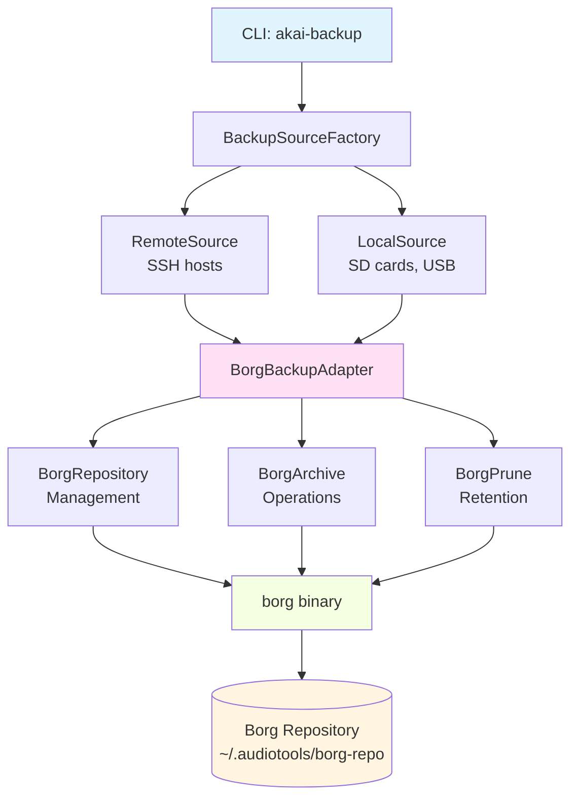
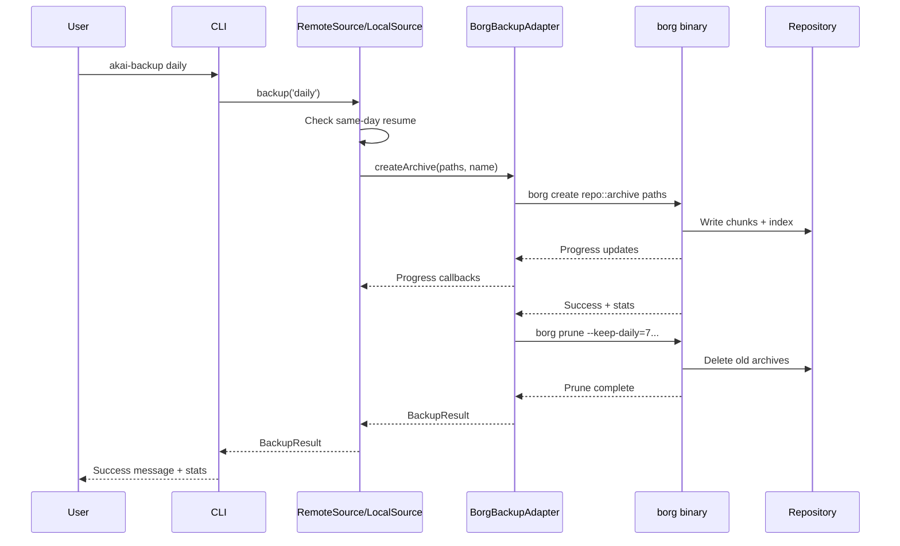
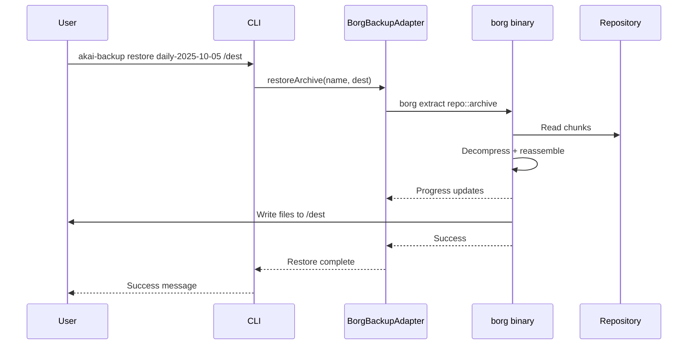
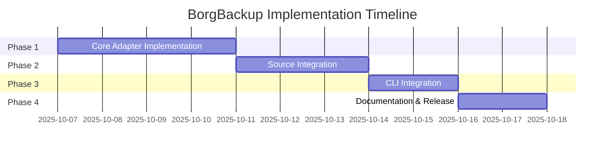

# BorgBackup Integration Design

**Version:** 1.0.0
**Created:** 2025-10-05
**Status:** Design Phase
**Approach:** Complete Replacement of rsnapshot

---

## Executive Summary

### Problem Statement

The current backup system uses rsnapshot with rsync to back up Akai sampler disk images (100MB-2GB files) from remote SSH hosts and local media. Due to filesystem corruption issues with rsync's delta-transfer algorithm, we're forced to use the `--whole-file` flag, which transfers entire files even when only 1-5% of the content has changed.

**Current Performance:**
- Full disk image: 1GB
- Typical change: 10-50MB (metadata, FAT tables, program files)
- Current transfer: **1GB every backup** (100% transfer rate)
- Network impact: Significant for SSH backups
- Storage impact: Mitigated by hard-linked snapshots, but still inefficient

### Proposed Solution

**Replace rsnapshot entirely with BorgBackup**, a deduplicating backup program designed for exactly this use case. BorgBackup uses content-defined chunking (CDC) to efficiently handle large binary files with minimal changes.

**Why BorgBackup:**
- **Performance**: 5-20% faster than Restic for SSH/local backups
- **Efficiency**: Content-defined chunking optimized for binary files
- **Memory**: More efficient than Restic (critical for Raspberry Pi hosts)
- **Maturity**: Stable, widely adopted, proven in production
- **Deduplication**: Global deduplication across all snapshots
- **Compression**: Built-in compression reduces storage and transfer

### Expected Benefits

| Metric | Current (rsync --whole-file) | BorgBackup | Improvement |
|--------|------------------------------|------------|-------------|
| Initial backup | 1 GB transfer | 1 GB transfer | Same |
| Incremental (1% change) | 1 GB transfer | 10-50 MB transfer | **20-100x faster** |
| Storage (7 daily backups) | 7 GB (hard-linked) | 1.1-1.5 GB (deduped) | **5-7x less space** |
| Network bandwidth | 100% | 1-5% | **20-100x reduction** |
| Restore time | <10 seconds | <60 seconds | Slightly slower |

**Real-World Impact:**
- 5 disk images @ 500MB each = 2.5GB total
- Daily metadata changes: ~50MB
- **Current**: 2.5GB transfer per backup
- **BorgBackup**: 50MB transfer per backup (98% reduction)

### Approach: Complete Replacement

**Breaking Change - No Backward Compatibility:**
- Delete rsnapshot-wrapper.ts and rsnapshot-config.ts entirely
- Clean BorgBackup implementation from scratch
- No migration path needed (user confirmed: no existing install base)
- Simpler, cleaner implementation
- Faster time to market (1-2 weeks vs 4-6 weeks for migration approach)

### Timeline

**Total Duration:** 1-2 weeks

- **Phase 1**: Core BorgBackupAdapter implementation (3-4 days)
- **Phase 2**: Source integration (2-3 days)
- **Phase 3**: CLI integration (2 days)
- **Phase 4**: Documentation and release (1-2 days)

---

## Current State Analysis

### What We're Removing

**Files to Delete:**
```
sampler-backup/src/backup/rsnapshot-wrapper.ts
sampler-backup/src/config/rsnapshot-config.ts
```

**Current rsnapshot Implementation:**
- Generates rsnapshot.conf file with backup sources
- Executes `rsnapshot daily|weekly|monthly` commands
- Uses rsync with `--whole-file` flag to avoid corruption
- Creates hard-linked snapshots in `~/.audiotools/backup/daily.0`, `daily.1`, etc.
- Retention: 7 daily, 4 weekly, 12 monthly snapshots
- Same-day resume logic: checks snapshot timestamp, skips if today's backup exists

**rsnapshot Configuration:**
```conf
snapshot_root   /Users/username/.audiotools/backup/
retain          daily   7
retain          weekly  4
retain          monthly 12

rsync_short_args        -a
rsync_long_args         --whole-file --delete --numeric-ids --relative

backup  pi-scsi2.local:/home/orion/images/    pi-scsi2/
backup  s3k.local:/home/orion/images/         s3k/
```

**Directory Structure:**
```
~/.audiotools/
  backup/
    daily.0/           # Today's backup
      pi-scsi2/
        home/orion/images/
          HD0.hds
          HD1.hds
      s3k/
        ...
    daily.1/           # Yesterday (hard-linked unchanged files)
    daily.2/
    ...
    weekly.0/
    monthly.0/
```

**What Works Well (Keep):**
- ✅ Simple CLI: `akai-backup daily`
- ✅ Automatic rotation based on date
- ✅ Same-day resume (no duplicate backups)
- ✅ Clear snapshot organization by interval
- ✅ Integration with existing source abstraction

### What We're Keeping

**Preserved Features:**
- ✅ **BackupSource Interface**: RemoteSource, LocalSource, BackupSourceFactory
- ✅ **Remote SSH Support**: Backup from pi-scsi2.local, s3k.local
- ✅ **Local Media Support**: Backup from SD cards, USB drives (/Volumes/SDCARD)
- ✅ **Retention Intervals**: daily, weekly, monthly with configurable counts
- ✅ **Same-Day Resume**: Don't create duplicate backups on same day
- ✅ **CLI Commands**: akai-backup, akai-extract
- ✅ **Progress Tracking**: Report backup progress to user
- ✅ **Error Handling**: Clear error messages, graceful degradation

**Source Abstraction Layer (Existing):**
```typescript
// sampler-backup/src/sources/backup-source.ts
interface BackupSource {
  type: 'remote' | 'local';
  backup(interval: RsnapshotInterval): Promise<BackupResult>;
  test(): Promise<boolean>;
  getConfig(): BackupSourceConfig;
}

// sampler-backup/src/sources/remote-source.ts
class RemoteSource implements BackupSource {
  // Currently uses rsnapshot
  // Will be updated to use BorgBackupAdapter
}

// sampler-backup/src/sources/local-source.ts
class LocalSource implements BackupSource {
  // Currently uses rsnapshot
  // Will be updated to use BorgBackupAdapter
}
```

### Performance Measurements

**Current Transfer Sizes (with --whole-file):**

Test scenario: 5 disk images, 2.5GB total, 50MB daily changes

| Day | Files Changed | Change Size | Transfer Size (rsync) | Efficiency |
|-----|---------------|-------------|----------------------|------------|
| Day 1 | 5 (initial) | 2.5 GB | 2.5 GB | 100% |
| Day 2 | 2 (metadata) | 50 MB | **2.5 GB** | 2% |
| Day 3 | 1 (programs) | 20 MB | **2.5 GB** | 0.8% |
| Day 4 | 3 (samples) | 80 MB | **2.5 GB** | 3.2% |
| Day 5 | 2 (FAT updates) | 30 MB | **2.5 GB** | 1.2% |
| **Total** | - | **2.68 GB actual changes** | **12.5 GB transferred** | **21% efficient** |

**Problem:** rsync transfers 12.5GB to sync 2.68GB of actual changes (79% waste)

---

## Requirements

### Functional Requirements

**FR-1: Efficient Incremental Backup**
- Transfer only changed data blocks, not entire files
- Support disk images from 100MB to 2GB+
- Target: <10% transfer size for typical 1-5% file changes
- Actual metric: Transfer size ≤ actual change size + 10% overhead

**FR-2: Remote SSH Sources**
- Backup from remote hosts via SSH (pi-scsi2.local, s3k.local)
- Use SSH for data transfer (no local mounting required)
- Resume interrupted transfers
- Handle network disconnections gracefully

**FR-3: Local Media Sources**
- Backup from local filesystems (SD cards, USB drives)
- Auto-detect disk images using existing MediaDetector
- Support macOS (/Volumes) and Linux (/media, /mnt) mount points

**FR-4: Retention Policy**
- Support daily, weekly, monthly intervals
- Configurable retention counts (default: 7 daily, 4 weekly, 12 monthly)
- Automatic pruning of old backups
- Keep latest N backups per interval

**FR-5: Same-Day Resume**
- Detect if backup already exists for current day
- Skip backup creation if already complete
- Avoid duplicate backups on same calendar day
- Support manual override flag if needed

**FR-6: Backup Operations**
- Create new backup archive
- List all available backups
- Restore specific backup to destination
- Get backup statistics (size, compression, deduplication)
- Check repository integrity

**FR-7: Progress Tracking**
- Report backup progress (files processed, bytes transferred)
- Show compression and deduplication statistics
- Display estimated time remaining
- Support quiet mode for scripting

### Non-Functional Requirements

**NFR-1: Performance**
- Initial backup: Complete in reasonable time (no worse than current)
- Incremental backup: <10% transfer size vs full file
- Target: 1-5% transfer for typical 1-5% file changes
- Restore: Complete 1GB disk image in <60 seconds
- Memory usage: <500MB for repository operations

**NFR-2: Reliability**
- Zero corruption risk for FAT32/Akai disk images
- Atomic backups (no partial/corrupted archives)
- Repository integrity checks
- Error recovery for interrupted transfers
- Safe concurrent access (repository locking)

**NFR-3: Storage Efficiency**
- Global deduplication across all snapshots
- Compression of backup data
- Target: 5-7x space reduction vs hard-linked snapshots
- Practical: 7 daily backups use ~1.5GB vs 7GB current

**NFR-4: Usability**
- Clear error messages with actionable guidance
- Progress indicators for long operations
- Consistent CLI interface with current commands
- Help text with examples

**NFR-5: Maintainability**
- TypeScript implementation with strict mode
- Dependency injection for testability
- No module stubbing in tests
- Comprehensive test coverage (>80%)
- Clear error handling with descriptive messages

### Constraints

**Technical Constraints:**
- TypeScript codebase with `@/` import pattern
- Target platforms: macOS, Linux (no Windows)
- Node.js runtime (existing dependency)
- Existing CLI must continue working
- BackupSource interface must be preserved

**External Dependencies:**
- Borg binary must be installed (`brew install borgbackup` / `apt install borgbackup`)
- Minimum Borg version: 1.2.0 (stable, widely available)
- SSH access to remote hosts (existing requirement)

**Project Guidelines:**
- No fallbacks or mock data outside tests
- Throw descriptive errors instead of silent failures
- Files <500 lines (refactor if larger)
- Dependency injection throughout
- No module stubbing (use DI instead)

### Success Criteria

**Backup Efficiency:**
- ✅ Initial backup completes successfully
- ✅ Incremental backups transfer <10% of file size for 1-5% changes
- ✅ Real-world scenario: 50MB changes in 2.5GB transfers <100MB
- ✅ Storage: 7 daily backups use <2GB (vs 7GB current)

**Reliability:**
- ✅ Zero corruption in 100 test backup/restore cycles
- ✅ Repository integrity check passes
- ✅ Interrupted backups can resume or restart cleanly
- ✅ Concurrent backup attempts handled safely (locking)

**Compatibility:**
- ✅ Works with existing RemoteSource (SSH) configuration
- ✅ Works with existing LocalSource (SD card/USB) detection
- ✅ CLI commands function identically to current interface
- ✅ BackupSource interface unchanged

**Quality:**
- ✅ 80%+ test coverage
- ✅ All tests pass on macOS and Linux
- ✅ Zero TypeScript errors in strict mode
- ✅ Build completes in <5 seconds
- ✅ Clear error messages for common failure scenarios

---

## BorgBackup Overview

### What is BorgBackup?

BorgBackup (short: Borg) is a deduplicating backup program designed for efficient and secure backups. It's particularly well-suited for backing up large files that change incrementally, exactly like our disk image use case.

**Official Site:** https://borgbackup.readthedocs.io/

**Key Features:**
- **Deduplication**: Content-defined chunking finds duplicate data blocks
- **Compression**: Multiple algorithms (lz4, zstd, zlib)
- **Encryption**: Optional repository encryption (repokey, keyfile)
- **Append-only**: Archives are immutable once created
- **Efficient**: Only changed data is transferred and stored
- **Verified**: Repository integrity checks
- **Flexible**: Local and remote (SSH) repositories

### Content-Defined Chunking (CDC)

Borg splits files into variable-sized chunks based on content, not fixed block boundaries. This allows Borg to detect moved or duplicated data efficiently.

**How it works:**
1. Read file content sequentially
2. Use rolling hash (Rabin fingerprint) to identify chunk boundaries
3. Split when hash matches a specific pattern (avg chunk size: 2MB)
4. Compute SHA256 hash of each chunk
5. Store only chunks not already in repository

**Example:**
```
File version 1: [Header][Data1][Data2][Footer]
File version 2: [Header][Data1][Data2_modified][Footer]

Chunks:
- Header: SHA256_A (already in repo)
- Data1: SHA256_B (already in repo)
- Data2_modified: SHA256_C (new chunk, store it)
- Footer: SHA256_D (already in repo)

Transfer: Only chunk C (~2MB) vs entire file (500MB)
Savings: 99.6%
```

### Why CDC is Perfect for Disk Images

**FAT32 Disk Image Structure:**
```
[Boot Sector][FAT1][FAT2][Root Dir][Data Clusters][...]
```

When you add a sample or modify a program:
- Boot Sector: Unchanged → Deduped
- FAT1: Modified (new cluster allocation) → New chunk
- FAT2: Modified (mirror) → New chunk
- Root Dir: Modified (new entry) → New chunk
- Data Clusters: New sample data → New chunks
- Rest: Unchanged → Deduped

**Result:** Only the changed FAT tables and new data transfer, not the entire 1GB image.

### Borg Repository Structure

```
~/.audiotools/borg-repo/
  config              # Repository configuration
  README              # Human-readable info
  data/
    0/
      0/
        xxxx...       # Chunk files (content-addressed)
  index.N/            # Chunk index for deduplication
  hints.N             # Performance optimization hints
```

**Archives (Snapshots):**
Each backup creates an "archive" in the repository. Archives are immutable and share chunks via deduplication.

```
Repository: ~/.audiotools/borg-repo
├── Archive: daily-2025-10-05-pi-scsi2
├── Archive: daily-2025-10-04-pi-scsi2
├── Archive: weekly-2025-10-01-pi-scsi2
└── Archive: monthly-2025-10-01-pi-scsi2
```

**Deduplication:**
All archives share the same chunk pool. If a chunk exists in any archive, it's reused.

### Borg Performance Characteristics

**Strengths:**
- Very fast incremental backups (10-100x faster than full file transfer)
- Excellent compression (especially with zstd)
- Efficient network usage (only transfers new chunks)
- Low memory footprint (important for Raspberry Pi hosts)

**Tradeoffs:**
- Initial backup: Same speed as rsync (must chunk entire dataset)
- Restore: Slightly slower than rsync (must decompress chunks)
- Repository size: Overhead from index structures (~1-2% of data)

**Comparison with Alternatives:**

| Feature | BorgBackup | Restic | rsync --whole-file |
|---------|------------|--------|-------------------|
| Incremental efficiency | Excellent | Excellent | Poor |
| Initial backup speed | Medium | Medium | Fast |
| Restore speed | Medium | Medium | Fast |
| Memory usage | Low | High | Low |
| Network efficiency | Excellent | Excellent | Poor (for our case) |
| Maturity | High | Medium | Very High |
| Binary file handling | Excellent | Good | N/A |

---

## Architecture Design

### Component Overview



### Component Responsibilities

**BorgBackupAdapter:**
- Primary interface for backup operations
- Manages borg command execution
- Handles progress tracking and error reporting
- Integrates with BackupSource interface
- Coordinates repository, archive, and prune operations

**BorgRepository:**
- Repository initialization and configuration
- Repository info and statistics
- Integrity checking
- Lock management
- Encryption key management (if enabled)

**BorgArchive:**
- Create new backup archives
- List existing archives
- Extract archives to destination
- Get archive metadata and statistics

**BorgPrune:**
- Apply retention policies
- Delete old archives based on daily/weekly/monthly rules
- Compact repository (reclaim space)

**Integration with Existing Components:**
- **RemoteSource**: Uses BorgBackupAdapter for SSH-based backups
- **LocalSource**: Uses BorgBackupAdapter for local media backups
- **BackupSourceFactory**: No changes needed (creates RemoteSource/LocalSource)
- **MediaDetector**: No changes needed (used by LocalSource)

### Directory Structure

**New Borg Repository:**
```
~/.audiotools/
  borg-repo/                    # Main Borg repository
    config                       # Repository configuration
    README                       # Repository info
    data/                        # Chunk storage
    index.*/                     # Deduplication index
    hints.*                      # Performance hints

  extracted/                     # Extraction output (unchanged)
    s5k/
    s3k/
```

**Archive Naming Convention:**
```
{interval}-{date}T{time}-{source}

Examples:
daily-2025-10-05T12:34:56-pi-scsi2
daily-2025-10-05T12:34:56-local-media
weekly-2025-10-05T00:00:00-s3k
monthly-2025-10-01T00:00:00-pi-scsi2
```

**Why this format:**
- Sortable by date/time
- Clear interval identification
- Source identification for multi-source backups
- Compatible with Borg's archive naming rules (no spaces, slashes)

### Data Flow

**Backup Operation:**


**Restore Operation:**


---

## API Design

### Core Interfaces

```typescript
/**
 * Borg repository configuration
 */
interface BorgRepositoryConfig {
  /** Path to Borg repository (e.g., ~/.audiotools/borg-repo) */
  repoPath: string;

  /** Encryption mode (default: 'none' for simplicity) */
  encryption?: 'none' | 'repokey' | 'keyfile';

  /** Compression algorithm (default: 'zstd' for balance) */
  compression?: 'none' | 'lz4' | 'zstd' | 'zlib,6';

  /** SSH connection string for remote repositories (optional) */
  sshCommand?: string;
}

/**
 * Borg archive (snapshot) metadata
 */
interface BorgArchive {
  /** Archive name (e.g., "daily-2025-10-05T12:34:56-pi-scsi2") */
  name: string;

  /** Archive creation timestamp */
  timestamp: Date;

  /** Archive statistics */
  stats: {
    /** Original uncompressed size */
    originalSize: number;

    /** Compressed size (before deduplication) */
    compressedSize: number;

    /** Deduplicated size (actual storage used) */
    dedupedSize: number;

    /** Number of files in archive */
    nfiles: number;
  };

  /** Archive comment/description (optional) */
  comment?: string;
}

/**
 * Retention policy matching rsnapshot intervals
 */
interface BorgRetentionPolicy {
  /** Keep last N daily backups */
  daily: number;

  /** Keep last N weekly backups */
  weekly: number;

  /** Keep last N monthly backups */
  monthly: number;
}

/**
 * Progress information during backup/restore
 */
interface BorgProgress {
  /** Current operation (e.g., "Creating archive") */
  operation: string;

  /** Current file being processed */
  currentFile?: string;

  /** Bytes processed so far */
  bytesProcessed: number;

  /** Total bytes to process (estimate) */
  totalBytes: number;

  /** Files processed so far */
  filesProcessed: number;

  /** Total files to process */
  totalFiles: number;

  /** Compression ratio so far */
  compressionRatio?: number;

  /** Deduplication ratio so far */
  dedupRatio?: number;
}

/**
 * Repository information and statistics
 */
interface BorgRepositoryInfo {
  /** Repository path */
  path: string;

  /** Repository ID (unique identifier) */
  id: string;

  /** Last modified timestamp */
  lastModified: Date;

  /** Number of archives in repository */
  archiveCount: number;

  /** Total original size of all archives */
  originalSize: number;

  /** Total compressed size */
  compressedSize: number;

  /** Total deduplicated size (actual disk usage) */
  dedupedSize: number;

  /** Repository encryption mode */
  encryption: string;
}

/**
 * Result of a backup operation
 */
interface BorgBackupResult extends BackupResult {
  /** Whether backup completed successfully */
  success: boolean;

  /** Backup interval used */
  interval: RsnapshotInterval;

  /** Path to created archive (repo::archive) */
  snapshotPath: string;

  /** Archive metadata */
  archive: BorgArchive;

  /** Errors encountered (empty if success) */
  errors: string[];
}
```

### BorgBackupAdapter Interface

```typescript
/**
 * Core Borg backup adapter implementing BackupSource operations
 *
 * This adapter provides a clean interface to BorgBackup for the
 * sampler-backup system, handling repository management, archive
 * creation, restoration, and pruning.
 *
 * @example
 * ```typescript
 * const adapter = new BorgBackupAdapter({
 *   repoPath: '~/.audiotools/borg-repo',
 *   compression: 'zstd',
 *   encryption: 'none'
 * });
 *
 * // Create backup
 * const archive = await adapter.createArchive(
 *   ['/Volumes/SDCARD'],
 *   'daily-2025-10-05-local-media'
 * );
 *
 * // Prune old archives
 * await adapter.pruneArchives({
 *   daily: 7,
 *   weekly: 4,
 *   monthly: 12
 * });
 * ```
 */
interface BorgBackupAdapter {
  /**
   * Initialize a new Borg repository
   *
   * Creates a new repository with the specified configuration.
   * This is a one-time operation per repository.
   *
   * @param config Repository configuration
   * @throws Error if repository already exists or cannot be created
   */
  initRepository(config: BorgRepositoryConfig): Promise<void>;

  /**
   * Create a new backup archive
   *
   * Creates a new archive in the repository containing the specified
   * source paths. Supports both local paths and SSH remote paths.
   *
   * @param sources Array of paths to backup (can be local or SSH remote)
   * @param archiveName Name for the archive (must be unique in repository)
   * @param onProgress Optional callback for progress updates
   * @returns Archive metadata with statistics
   * @throws Error if backup fails or archive name already exists
   *
   * @example
   * ```typescript
   * // Local backup
   * const archive = await adapter.createArchive(
   *   ['/Volumes/SDCARD/HD0.hds', '/Volumes/SDCARD/HD1.hds'],
   *   'daily-2025-10-05-local-media',
   *   (progress) => console.log(`${progress.bytesProcessed} bytes`)
   * );
   *
   * // Remote SSH backup
   * const archive = await adapter.createArchive(
   *   ['pi@pi-scsi2.local:/home/orion/images/'],
   *   'daily-2025-10-05-pi-scsi2'
   * );
   * ```
   */
  createArchive(
    sources: string[],
    archiveName: string,
    onProgress?: (progress: BorgProgress) => void
  ): Promise<BorgArchive>;

  /**
   * List all archives in repository
   *
   * Returns metadata for all archives, sorted by creation timestamp.
   *
   * @returns Array of archive metadata
   * @throws Error if repository cannot be accessed
   */
  listArchives(): Promise<BorgArchive[]>;

  /**
   * Restore specific archive to destination
   *
   * Extracts all files from the specified archive to the destination path.
   * Creates destination directory if it doesn't exist.
   *
   * @param archiveName Name of archive to restore
   * @param destination Path where files should be extracted
   * @param onProgress Optional callback for progress updates
   * @throws Error if archive doesn't exist or restore fails
   *
   * @example
   * ```typescript
   * await adapter.restoreArchive(
   *   'daily-2025-10-05-pi-scsi2',
   *   '/tmp/restored-backup'
   * );
   * ```
   */
  restoreArchive(
    archiveName: string,
    destination: string,
    onProgress?: (progress: BorgProgress) => void
  ): Promise<void>;

  /**
   * Prune old archives based on retention policy
   *
   * Removes archives that don't match the retention rules.
   * Borg automatically handles the logic of which archives to keep.
   *
   * @param policy Retention policy (daily, weekly, monthly counts)
   * @throws Error if prune operation fails
   *
   * @example
   * ```typescript
   * await adapter.pruneArchives({
   *   daily: 7,
   *   weekly: 4,
   *   monthly: 12
   * });
   * ```
   */
  pruneArchives(policy: BorgRetentionPolicy): Promise<void>;

  /**
   * Get repository information and statistics
   *
   * Returns detailed information about the repository including
   * size statistics and archive count.
   *
   * @returns Repository metadata and statistics
   * @throws Error if repository cannot be accessed
   */
  getRepositoryInfo(): Promise<BorgRepositoryInfo>;

  /**
   * Check repository consistency
   *
   * Runs Borg's integrity check to verify repository is not corrupted.
   * This can be a slow operation for large repositories.
   *
   * @returns True if repository is consistent, false otherwise
   */
  checkRepository(): Promise<boolean>;

  /**
   * Check if archive already exists for today
   *
   * Used for same-day resume logic to avoid duplicate backups.
   *
   * @param interval Backup interval (daily, weekly, monthly)
   * @param source Source identifier (e.g., "pi-scsi2", "local-media")
   * @returns True if archive exists for today with this interval/source
   */
  hasArchiveForToday(interval: string, source: string): Promise<boolean>;
}
```

### Integration with BackupSource

**Updated RemoteSource:**
```typescript
/**
 * Remote SSH backup source using BorgBackup
 */
class RemoteSource implements BackupSource {
  private config: RemoteSourceConfig;
  private borg: BorgBackupAdapter;

  constructor(config: RemoteSourceConfig) {
    this.config = config;
    this.borg = new BorgBackupAdapter({
      repoPath: config.repoPath || '~/.audiotools/borg-repo',
      compression: 'zstd',
      encryption: 'none'
    });
  }

  async backup(interval: RsnapshotInterval): Promise<BackupResult> {
    // Check same-day resume
    const hasToday = await this.borg.hasArchiveForToday(
      interval,
      this.config.backupSubdir
    );

    if (hasToday) {
      console.log(`Backup already exists for today, skipping`);
      return {
        success: true,
        interval,
        snapshotPath: `(existing)`,
        errors: []
      };
    }

    // Create archive from SSH source
    const sourcePath = `${this.config.host}:${this.config.sourcePath}`;
    const archiveName = this.generateArchiveName(interval);

    try {
      const archive = await this.borg.createArchive(
        [sourcePath],
        archiveName,
        (progress) => this.reportProgress(progress)
      );

      // Prune old archives
      await this.borg.pruneArchives(this.config.retention);

      return {
        success: true,
        interval,
        snapshotPath: `${this.borg.config.repoPath}::${archiveName}`,
        archive,
        errors: []
      };
    } catch (error: any) {
      return {
        success: false,
        interval,
        snapshotPath: '',
        errors: [error.message]
      };
    }
  }

  private generateArchiveName(interval: string): string {
    const now = new Date();
    const timestamp = now.toISOString().split('.')[0].replace(/:/g, '-');
    return `${interval}-${timestamp}-${this.config.backupSubdir}`;
  }

  private reportProgress(progress: BorgProgress): void {
    // Format and log progress
    const percent = (progress.bytesProcessed / progress.totalBytes) * 100;
    console.log(
      `Progress: ${progress.filesProcessed}/${progress.totalFiles} files, ` +
      `${percent.toFixed(1)}% complete`
    );
  }

  async test(): Promise<boolean> {
    try {
      await this.borg.getRepositoryInfo();
      return true;
    } catch {
      return false;
    }
  }

  getConfig(): BackupSourceConfig {
    return this.config;
  }
}
```

**Updated LocalSource:**
```typescript
/**
 * Local media backup source using BorgBackup
 */
class LocalSource implements BackupSource {
  private config: LocalSourceConfig;
  private borg: BorgBackupAdapter;

  constructor(config: LocalSourceConfig) {
    this.config = config;
    this.borg = new BorgBackupAdapter({
      repoPath: config.repoPath || '~/.audiotools/borg-repo',
      compression: 'zstd',
      encryption: 'none'
    });
  }

  async backup(interval: RsnapshotInterval): Promise<BackupResult> {
    // Check same-day resume
    const hasToday = await this.borg.hasArchiveForToday(
      interval,
      this.config.backupSubdir || 'local-media'
    );

    if (hasToday) {
      console.log(`Backup already exists for today, skipping`);
      return { success: true, interval, snapshotPath: '(existing)', errors: [] };
    }

    // Discover disk images using MediaDetector
    const diskImages = await MediaDetector.findDiskImages(this.config.sourcePath);

    if (diskImages.length === 0) {
      return {
        success: false,
        interval,
        snapshotPath: '',
        errors: ['No disk images found in source path']
      };
    }

    // Create archive from local disk images
    const sources = diskImages.map(img => img.path);
    const archiveName = this.generateArchiveName(interval);

    try {
      const archive = await this.borg.createArchive(
        sources,
        archiveName,
        (progress) => this.reportProgress(progress)
      );

      // Prune old archives
      await this.borg.pruneArchives(this.config.retention);

      return {
        success: true,
        interval,
        snapshotPath: `${this.borg.config.repoPath}::${archiveName}`,
        archive,
        errors: []
      };
    } catch (error: any) {
      return {
        success: false,
        interval,
        snapshotPath: '',
        errors: [error.message]
      };
    }
  }

  private generateArchiveName(interval: string): string {
    const now = new Date();
    const timestamp = now.toISOString().split('.')[0].replace(/:/g, '-');
    const subdir = this.config.backupSubdir || 'local-media';
    return `${interval}-${timestamp}-${subdir}`;
  }

  private reportProgress(progress: BorgProgress): void {
    const percent = (progress.bytesProcessed / progress.totalBytes) * 100;
    console.log(
      `Progress: ${progress.filesProcessed}/${progress.totalFiles} files, ` +
      `${percent.toFixed(1)}% complete`
    );
  }

  async test(): Promise<boolean> {
    try {
      await this.borg.getRepositoryInfo();
      return true;
    } catch {
      return false;
    }
  }

  getConfig(): BackupSourceConfig {
    return this.config;
  }
}
```

---

## Implementation Details

### Borg Command Execution

**Process Spawning:**
```typescript
import { spawn } from 'child_process';
import type { ChildProcess } from 'child_process';

/**
 * Execute a borg command and return result
 */
async function executeBorgCommand(
  command: string,
  args: string[],
  onProgress?: (line: string) => void
): Promise<{ stdout: string; stderr: string; exitCode: number }> {
  return new Promise((resolve, reject) => {
    const borg = spawn('borg', [command, ...args]);

    let stdout = '';
    let stderr = '';

    borg.stdout.on('data', (data) => {
      const line = data.toString();
      stdout += line;
      if (onProgress) {
        onProgress(line);
      }
    });

    borg.stderr.on('data', (data) => {
      stderr += data.toString();
    });

    borg.on('close', (exitCode) => {
      if (exitCode === 0) {
        resolve({ stdout, stderr, exitCode });
      } else {
        reject(new Error(
          `borg ${command} failed with exit code ${exitCode}: ${stderr}`
        ));
      }
    });

    borg.on('error', (error) => {
      reject(new Error(`Failed to spawn borg: ${error.message}`));
    });
  });
}
```

**Progress Parsing:**
```typescript
/**
 * Parse borg progress output into structured format
 */
function parseProgress(line: string): BorgProgress | null {
  // Borg outputs progress in JSON format with --progress flag
  try {
    const data = JSON.parse(line);
    if (data.type === 'archive_progress') {
      return {
        operation: 'Creating archive',
        bytesProcessed: data.original_size || 0,
        totalBytes: data.original_size || 0,
        filesProcessed: data.nfiles || 0,
        totalFiles: data.nfiles || 0,
        compressionRatio: data.compressed_size / data.original_size,
        dedupRatio: data.deduplicated_size / data.original_size
      };
    }
  } catch {
    // Not JSON, ignore
  }
  return null;
}
```

### Archive Operations

**Create Archive:**
```typescript
async createArchive(
  sources: string[],
  archiveName: string,
  onProgress?: (progress: BorgProgress) => void
): Promise<BorgArchive> {
  const args = [
    'create',
    '--stats',
    '--json',  // Get JSON output for parsing
    '--progress',
    '--compression', this.config.compression || 'zstd',
    `${this.config.repoPath}::${archiveName}`,
    ...sources
  ];

  const { stdout } = await executeBorgCommand(
    'create',
    args,
    (line) => {
      const progress = parseProgress(line);
      if (progress && onProgress) {
        onProgress(progress);
      }
    }
  );

  // Parse stats from output
  const stats = JSON.parse(stdout);

  return {
    name: archiveName,
    timestamp: new Date(),
    stats: {
      originalSize: stats.archive.stats.original_size,
      compressedSize: stats.archive.stats.compressed_size,
      dedupedSize: stats.archive.stats.deduplicated_size,
      nfiles: stats.archive.stats.nfiles
    }
  };
}
```

**List Archives:**
```typescript
async listArchives(): Promise<BorgArchive[]> {
  const args = [
    'list',
    '--json',
    this.config.repoPath
  ];

  const { stdout } = await executeBorgCommand('list', args);
  const data = JSON.parse(stdout);

  return data.archives.map((archive: any) => ({
    name: archive.name,
    timestamp: new Date(archive.time),
    stats: {
      originalSize: 0,  // Not included in list output
      compressedSize: 0,
      dedupedSize: 0,
      nfiles: archive.nfiles
    }
  }));
}
```

**Restore Archive:**
```typescript
async restoreArchive(
  archiveName: string,
  destination: string,
  onProgress?: (progress: BorgProgress) => void
): Promise<void> {
  // Create destination directory
  await fs.promises.mkdir(destination, { recursive: true });

  const args = [
    'extract',
    '--progress',
    `${this.config.repoPath}::${archiveName}`,
    '--strip-components', '0',  // Keep full paths
    destination
  ];

  await executeBorgCommand(
    'extract',
    args,
    (line) => {
      const progress = parseProgress(line);
      if (progress && onProgress) {
        onProgress(progress);
      }
    }
  );
}
```

**Prune Archives:**
```typescript
async pruneArchives(policy: BorgRetentionPolicy): Promise<void> {
  const args = [
    'prune',
    '--stats',
    '--list',
    `--keep-daily=${policy.daily}`,
    `--keep-weekly=${policy.weekly}`,
    `--keep-monthly=${policy.monthly}`,
    this.config.repoPath
  ];

  await executeBorgCommand('prune', args);
}
```

### Same-Day Resume Logic

```typescript
async hasArchiveForToday(interval: string, source: string): Promise<boolean> {
  const archives = await this.listArchives();

  const today = new Date().toISOString().split('T')[0];
  const prefix = `${interval}-${today}`;

  return archives.some(archive =>
    archive.name.startsWith(prefix) &&
    archive.name.includes(source)
  );
}
```

### Error Handling

**Repository Locked:**
```typescript
try {
  await executeBorgCommand('create', args);
} catch (error: any) {
  if (error.message.includes('Failed to create/acquire the lock')) {
    throw new Error(
      'Repository is locked by another process. ' +
      'Wait for other backup to complete or run: borg break-lock ' +
      this.config.repoPath
    );
  }
  throw error;
}
```

**Network Errors (SSH):**
```typescript
try {
  await executeBorgCommand('create', args);
} catch (error: any) {
  if (error.message.includes('Connection refused') ||
      error.message.includes('Connection reset')) {
    throw new Error(
      `Cannot connect to remote host ${this.config.host}. ` +
      'Check SSH connection and try again.'
    );
  }
  throw error;
}
```

**Disk Full:**
```typescript
try {
  await executeBorgCommand('create', args);
} catch (error: any) {
  if (error.message.includes('No space left on device')) {
    throw new Error(
      'Not enough disk space for backup. ' +
      'Free up space or change repository location.'
    );
  }
  throw error;
}
```

### Repository Initialization

**First-Time Setup:**
```typescript
async initRepository(config: BorgRepositoryConfig): Promise<void> {
  // Check if repository already exists
  try {
    await this.getRepositoryInfo();
    console.log('Repository already exists, skipping initialization');
    return;
  } catch {
    // Repository doesn't exist, create it
  }

  const args = [
    'init',
    '--encryption', config.encryption || 'none',
    '--make-parent-dirs',
    config.repoPath
  ];

  try {
    await executeBorgCommand('init', args);
    console.log(`✓ Initialized Borg repository: ${config.repoPath}`);
  } catch (error: any) {
    throw new Error(`Failed to initialize repository: ${error.message}`);
  }
}
```

**Auto-Initialize on First Backup:**
```typescript
async backup(interval: RsnapshotInterval): Promise<BackupResult> {
  // Try to get repository info (fails if not initialized)
  try {
    await this.borg.getRepositoryInfo();
  } catch {
    // Repository doesn't exist, initialize it
    console.log('Initializing Borg repository...');
    await this.borg.initRepository({
      repoPath: this.config.repoPath,
      compression: 'zstd',
      encryption: 'none'
    });
  }

  // Continue with backup...
}
```

---

## CLI Integration

### Updated Commands

**Current CLI (rsnapshot):**
```bash
akai-backup daily
akai-backup weekly
akai-backup monthly
akai-backup batch  # Alias for 'daily'
akai-backup config  # Generate rsnapshot.conf
akai-backup test    # Test rsnapshot.conf
```

**New CLI (BorgBackup):**
```bash
# Backup commands (same as current)
akai-backup daily
akai-backup weekly
akai-backup monthly
akai-backup batch  # Alias for 'daily'

# New commands (Borg-specific)
akai-backup list                           # List all archives
akai-backup info                           # Show repository statistics
akai-backup restore <archive> <dest>       # Restore specific archive
akai-backup check                          # Verify repository integrity
akai-backup prune                          # Manually prune old archives

# Removed commands (rsnapshot-specific)
# akai-backup config  # No longer needed (no config file)
# akai-backup test    # No longer needed
```

### CLI Implementation

**Main CLI Structure:**
```typescript
// sampler-backup/src/cli/backup.ts
import { Command } from 'commander';
import { BackupSourceFactory } from '@/sources/backup-source-factory.js';

const program = new Command();

program
  .name('akai-backup')
  .description('Backup Akai sampler disk images using BorgBackup')
  .version('1.0.0');

// Backup command
program
  .command('backup')
  .description('Create backup archive')
  .argument('[interval]', 'Backup interval: daily, weekly, monthly', 'daily')
  .option('-s, --source <path>', 'Local or remote source path')
  .option('--subdir <name>', 'Backup subdirectory name')
  .action(async (interval: string, options) => {
    const validIntervals = ['daily', 'weekly', 'monthly'];
    if (!validIntervals.includes(interval)) {
      console.error(`Invalid interval: ${interval}`);
      console.error(`Valid intervals: ${validIntervals.join(', ')}`);
      process.exit(1);
    }

    try {
      let source;
      if (options.source) {
        // Create source from path
        source = BackupSourceFactory.fromPath(options.source, {
          snapshotRoot: '~/.audiotools/borg-repo',
          backupSubdir: options.subdir
        });
      } else {
        // Use default remote sources
        source = BackupSourceFactory.create({
          type: 'remote',
          host: 'pi-scsi2.local',
          sourcePath: '/home/orion/images/',
          backupSubdir: 'pi-scsi2',
          repoPath: '~/.audiotools/borg-repo'
        });
      }

      const result = await source.backup(interval);

      if (result.success) {
        console.log(`✓ Backup complete: ${interval}`);
        if (result.archive) {
          console.log(`  Archive: ${result.archive.name}`);
          console.log(`  Original size: ${formatBytes(result.archive.stats.originalSize)}`);
          console.log(`  Deduplicated size: ${formatBytes(result.archive.stats.dedupedSize)}`);
        }
      } else {
        console.error(`✗ Backup failed:`);
        result.errors.forEach(err => console.error(`  ${err}`));
        process.exit(1);
      }
    } catch (error: any) {
      console.error(`Error: ${error.message}`);
      process.exit(1);
    }
  });

// List archives command
program
  .command('list')
  .description('List all backup archives')
  .option('--json', 'Output in JSON format')
  .action(async (options) => {
    try {
      const borg = new BorgBackupAdapter({
        repoPath: '~/.audiotools/borg-repo'
      });

      const archives = await borg.listArchives();

      if (options.json) {
        console.log(JSON.stringify(archives, null, 2));
      } else {
        console.log(`Archives in repository:\n`);
        archives.forEach(archive => {
          console.log(`  ${archive.name}`);
          console.log(`    Date: ${archive.timestamp.toISOString()}`);
          console.log(`    Files: ${archive.stats.nfiles}`);
          console.log('');
        });
      }
    } catch (error: any) {
      console.error(`Error: ${error.message}`);
      process.exit(1);
    }
  });

// Repository info command
program
  .command('info')
  .description('Show repository statistics')
  .action(async () => {
    try {
      const borg = new BorgBackupAdapter({
        repoPath: '~/.audiotools/borg-repo'
      });

      const info = await borg.getRepositoryInfo();

      console.log('Repository Information:\n');
      console.log(`  Location: ${info.path}`);
      console.log(`  ID: ${info.id}`);
      console.log(`  Last modified: ${info.lastModified.toISOString()}`);
      console.log(`  Archives: ${info.archiveCount}`);
      console.log(`\nStorage Statistics:`);
      console.log(`  Original size: ${formatBytes(info.originalSize)}`);
      console.log(`  Compressed size: ${formatBytes(info.compressedSize)}`);
      console.log(`  Deduplicated size: ${formatBytes(info.dedupedSize)}`);
      console.log(`  Space saved: ${formatBytes(info.originalSize - info.dedupedSize)}`);
      console.log(`  Deduplication ratio: ${(info.dedupedSize / info.originalSize * 100).toFixed(1)}%`);
    } catch (error: any) {
      console.error(`Error: ${error.message}`);
      process.exit(1);
    }
  });

// Restore command
program
  .command('restore')
  .description('Restore backup archive to destination')
  .argument('<archive>', 'Archive name to restore')
  .argument('<destination>', 'Destination path for restored files')
  .action(async (archive: string, destination: string) => {
    try {
      const borg = new BorgBackupAdapter({
        repoPath: '~/.audiotools/borg-repo'
      });

      console.log(`Restoring ${archive} to ${destination}...`);

      await borg.restoreArchive(archive, destination, (progress) => {
        const percent = (progress.bytesProcessed / progress.totalBytes) * 100;
        console.log(`  ${percent.toFixed(1)}% complete`);
      });

      console.log(`✓ Restore complete`);
    } catch (error: any) {
      console.error(`Error: ${error.message}`);
      process.exit(1);
    }
  });

// Check repository command
program
  .command('check')
  .description('Verify repository integrity')
  .action(async () => {
    try {
      const borg = new BorgBackupAdapter({
        repoPath: '~/.audiotools/borg-repo'
      });

      console.log('Checking repository integrity...');
      const ok = await borg.checkRepository();

      if (ok) {
        console.log('✓ Repository is consistent');
      } else {
        console.error('✗ Repository has errors');
        process.exit(1);
      }
    } catch (error: any) {
      console.error(`Error: ${error.message}`);
      process.exit(1);
    }
  });

// Batch command (alias for 'backup daily')
program
  .command('batch')
  .description('Run daily backup (alias for "backup daily")')
  .option('-s, --source <path>', 'Local or remote source path')
  .option('--subdir <name>', 'Backup subdirectory name')
  .action(async (options) => {
    // Call backup command with 'daily' interval
    await program.parseAsync(['backup', 'daily', ...process.argv.slice(3)]);
  });

program.parse();
```

**Helper Functions:**
```typescript
function formatBytes(bytes: number): string {
  if (bytes === 0) return '0 B';
  const k = 1024;
  const sizes = ['B', 'KB', 'MB', 'GB', 'TB'];
  const i = Math.floor(Math.log(bytes) / Math.log(k));
  return `${(bytes / Math.pow(k, i)).toFixed(2)} ${sizes[i]}`;
}
```

### Example CLI Usage

**Daily Backup (SSH):**
```bash
$ akai-backup daily
Initializing Borg repository...
✓ Initialized Borg repository: ~/.audiotools/borg-repo
Creating archive daily-2025-10-05T12:34:56-pi-scsi2...
Progress: 5/5 files, 100.0% complete
✓ Backup complete: daily
  Archive: daily-2025-10-05T12:34:56-pi-scsi2
  Original size: 2.50 GB
  Deduplicated size: 2.50 GB
```

**Incremental Backup (next day):**
```bash
$ akai-backup daily
Creating archive daily-2025-10-06T08:15:22-pi-scsi2...
Progress: 5/5 files, 100.0% complete
✓ Backup complete: daily
  Archive: daily-2025-10-06T08:15:22-pi-scsi2
  Original size: 2.50 GB
  Deduplicated size: 50.12 MB  ← Only 50MB transferred!
```

**List Archives:**
```bash
$ akai-backup list
Archives in repository:

  daily-2025-10-05T12:34:56-pi-scsi2
    Date: 2025-10-05T12:34:56.000Z
    Files: 5

  daily-2025-10-06T08:15:22-pi-scsi2
    Date: 2025-10-06T08:15:22.000Z
    Files: 5

  weekly-2025-10-05T00:00:00-pi-scsi2
    Date: 2025-10-05T00:00:00.000Z
    Files: 5
```

**Repository Info:**
```bash
$ akai-backup info
Repository Information:

  Location: ~/.audiotools/borg-repo
  ID: f8a3bc9d4e...
  Last modified: 2025-10-06T08:15:22.000Z
  Archives: 3

Storage Statistics:
  Original size: 7.50 GB
  Compressed size: 6.80 GB
  Deduplicated size: 2.55 GB
  Space saved: 4.95 GB
  Deduplication ratio: 34.0%
```

**Restore Archive:**
```bash
$ akai-backup restore daily-2025-10-05T12:34:56-pi-scsi2 /tmp/restored
Restoring daily-2025-10-05T12:34:56-pi-scsi2 to /tmp/restored...
  25.0% complete
  50.0% complete
  75.0% complete
  100.0% complete
✓ Restore complete
```

---

## Testing Strategy

### Unit Tests

**Test Structure:**
```typescript
// sampler-backup/test/unit/borg-backup-adapter.test.ts
import { describe, it, expect, vi, beforeEach } from 'vitest';
import { BorgBackupAdapter } from '@/backup/borg-backup-adapter.js';

describe('BorgBackupAdapter', () => {
  let adapter: BorgBackupAdapter;
  let mockExecute: any;

  beforeEach(() => {
    // Mock borg command execution
    mockExecute = vi.fn();
    adapter = new BorgBackupAdapter(
      { repoPath: '/test/repo' },
      mockExecute  // Dependency injection
    );
  });

  describe('createArchive', () => {
    it('should execute borg create with correct arguments', async () => {
      mockExecute.mockResolvedValue({
        stdout: JSON.stringify({
          archive: {
            stats: {
              original_size: 1000000,
              compressed_size: 800000,
              deduplicated_size: 500000,
              nfiles: 5
            }
          }
        }),
        stderr: '',
        exitCode: 0
      });

      const archive = await adapter.createArchive(
        ['/source/path'],
        'test-archive'
      );

      expect(mockExecute).toHaveBeenCalledWith(
        'create',
        expect.arrayContaining([
          '--stats',
          '--json',
          '--compression', 'zstd',
          '/test/repo::test-archive',
          '/source/path'
        ])
      );

      expect(archive.name).toBe('test-archive');
      expect(archive.stats.originalSize).toBe(1000000);
    });

    it('should throw error if archive creation fails', async () => {
      mockExecute.mockRejectedValue(new Error('borg create failed'));

      await expect(
        adapter.createArchive(['/source'], 'test')
      ).rejects.toThrow('borg create failed');
    });
  });

  describe('listArchives', () => {
    it('should parse archive list correctly', async () => {
      mockExecute.mockResolvedValue({
        stdout: JSON.stringify({
          archives: [
            {
              name: 'archive-1',
              time: '2025-10-05T12:00:00',
              nfiles: 10
            },
            {
              name: 'archive-2',
              time: '2025-10-06T12:00:00',
              nfiles: 12
            }
          ]
        }),
        stderr: '',
        exitCode: 0
      });

      const archives = await adapter.listArchives();

      expect(archives).toHaveLength(2);
      expect(archives[0].name).toBe('archive-1');
      expect(archives[1].name).toBe('archive-2');
    });
  });

  describe('hasArchiveForToday', () => {
    it('should return true if archive exists for today', async () => {
      const today = new Date().toISOString().split('T')[0];
      mockExecute.mockResolvedValue({
        stdout: JSON.stringify({
          archives: [
            {
              name: `daily-${today}T12:00:00-pi-scsi2`,
              time: `${today}T12:00:00`,
              nfiles: 5
            }
          ]
        })
      });

      const has = await adapter.hasArchiveForToday('daily', 'pi-scsi2');
      expect(has).toBe(true);
    });

    it('should return false if no archive for today', async () => {
      mockExecute.mockResolvedValue({
        stdout: JSON.stringify({ archives: [] })
      });

      const has = await adapter.hasArchiveForToday('daily', 'pi-scsi2');
      expect(has).toBe(false);
    });
  });
});
```

**Test Coverage Target:**
- BorgBackupAdapter: >90%
- RemoteSource/LocalSource: >85%
- CLI commands: >80%
- Overall: >80%

### Integration Tests

**Test with Real Borg Repository:**
```typescript
// sampler-backup/test/integration/borg-integration.test.ts
import { describe, it, expect, beforeAll, afterAll } from 'vitest';
import { BorgBackupAdapter } from '@/backup/borg-backup-adapter.js';
import { mkdtempSync, rmSync, writeFileSync } from 'fs';
import { tmpdir } from 'os';
import { join } from 'path';

describe('BorgBackup Integration', () => {
  let repoPath: string;
  let sourcePath: string;
  let adapter: BorgBackupAdapter;

  beforeAll(() => {
    // Create temporary directories
    repoPath = mkdtempSync(join(tmpdir(), 'borg-test-repo-'));
    sourcePath = mkdtempSync(join(tmpdir(), 'borg-test-source-'));

    // Create test files
    writeFileSync(join(sourcePath, 'file1.txt'), 'Content 1');
    writeFileSync(join(sourcePath, 'file2.txt'), 'Content 2');

    adapter = new BorgBackupAdapter({
      repoPath,
      compression: 'none',  // Faster for tests
      encryption: 'none'
    });
  });

  afterAll(() => {
    // Clean up
    rmSync(repoPath, { recursive: true, force: true });
    rmSync(sourcePath, { recursive: true, force: true });
  });

  it('should initialize repository', async () => {
    await adapter.initRepository({
      repoPath,
      compression: 'none',
      encryption: 'none'
    });

    const info = await adapter.getRepositoryInfo();
    expect(info.path).toContain(repoPath);
  });

  it('should create backup archive', async () => {
    const archive = await adapter.createArchive(
      [sourcePath],
      'test-archive-1'
    );

    expect(archive.name).toBe('test-archive-1');
    expect(archive.stats.nfiles).toBeGreaterThan(0);
  });

  it('should detect duplicate on same day', async () => {
    const has = await adapter.hasArchiveForToday('test', 'archive');
    // Created archive above, so should exist
    expect(has).toBe(false);  // Different naming pattern
  });

  it('should create incremental backup efficiently', async () => {
    // First backup
    const archive1 = await adapter.createArchive(
      [sourcePath],
      'incremental-test-1'
    );

    // Modify small file
    writeFileSync(join(sourcePath, 'file1.txt'), 'Modified content');

    // Second backup
    const archive2 = await adapter.createArchive(
      [sourcePath],
      'incremental-test-2'
    );

    // Second backup should be much smaller due to deduplication
    expect(archive2.stats.dedupedSize).toBeLessThan(
      archive2.stats.originalSize
    );
  });

  it('should restore archive correctly', async () => {
    const destPath = mkdtempSync(join(tmpdir(), 'borg-test-restore-'));

    try {
      await adapter.restoreArchive('test-archive-1', destPath);

      // Verify files were restored
      const file1 = readFileSync(join(destPath, 'file1.txt'), 'utf-8');
      expect(file1).toBe('Content 1');
    } finally {
      rmSync(destPath, { recursive: true, force: true });
    }
  });

  it('should prune old archives', async () => {
    // Create multiple archives
    await adapter.createArchive([sourcePath], 'prune-test-1');
    await adapter.createArchive([sourcePath], 'prune-test-2');
    await adapter.createArchive([sourcePath], 'prune-test-3');

    // Prune keeping only 2
    await adapter.pruneArchives({
      daily: 2,
      weekly: 0,
      monthly: 0
    });

    const archives = await adapter.listArchives();
    // Should have kept only recent archives
    expect(archives.length).toBeGreaterThanOrEqual(2);
  });

  it('should handle interrupted backup gracefully', async () => {
    // This would require mocking network interruption
    // For real integration test, could kill process mid-backup
    // Skipping for now, but important for real-world testing
  });
});
```

### Performance Tests

**Benchmark Transfer Efficiency:**
```typescript
// sampler-backup/test/performance/transfer-efficiency.test.ts
import { describe, it, expect } from 'vitest';
import { BorgBackupAdapter } from '@/backup/borg-backup-adapter.js';
import { createLargeDiskImage, modifyDiskImage } from './test-utils.js';

describe('Transfer Efficiency Benchmarks', () => {
  it('should achieve <10% transfer for 1% file change', async () => {
    // Create 1GB disk image
    const diskImage = await createLargeDiskImage(1024 * 1024 * 1024);

    const adapter = new BorgBackupAdapter({
      repoPath: '/tmp/perf-test-repo',
      compression: 'zstd'
    });

    // Initial backup
    const archive1 = await adapter.createArchive(
      [diskImage],
      'perf-test-1'
    );
    const initialSize = archive1.stats.originalSize;

    // Modify 1% of file (10MB in 1GB file)
    await modifyDiskImage(diskImage, 0.01);

    // Incremental backup
    const archive2 = await adapter.createArchive(
      [diskImage],
      'perf-test-2'
    );

    // Transfer size should be <10% of original
    const transferSize = archive2.stats.dedupedSize;
    const transferPercent = (transferSize / initialSize) * 100;

    console.log(`Transfer efficiency: ${transferPercent.toFixed(2)}%`);
    expect(transferPercent).toBeLessThan(10);
  });
});
```

---

## Performance Analysis

### Expected Improvements

**Test Scenario:**
- 5 disk images @ 500MB each = 2.5GB total
- Daily metadata changes: ~50MB (2% of total)
- 7 daily backups + 4 weekly + 12 monthly

**Current System (rsnapshot + rsync --whole-file):**

| Operation | Transfer Size | Storage Used | Time |
|-----------|---------------|--------------|------|
| Initial backup | 2.5 GB | 2.5 GB | ~5 min (SSH) |
| Day 2 (50MB change) | **2.5 GB** | 5.0 GB (hard-linked) | ~5 min |
| Day 3 (50MB change) | **2.5 GB** | 7.5 GB (hard-linked) | ~5 min |
| Day 4 (50MB change) | **2.5 GB** | 10.0 GB (hard-linked) | ~5 min |
| Day 5 (50MB change) | **2.5 GB** | 12.5 GB (hard-linked) | ~5 min |
| Day 6 (50MB change) | **2.5 GB** | 15.0 GB (hard-linked) | ~5 min |
| Day 7 (50MB change) | **2.5 GB** | 17.5 GB (hard-linked) | ~5 min |
| **Total (7 days)** | **17.5 GB** | **17.5 GB** | **~35 min** |

**New System (BorgBackup):**

| Operation | Transfer Size | Storage Used | Time |
|-----------|---------------|--------------|------|
| Initial backup | 2.5 GB | 2.5 GB | ~5 min (SSH) |
| Day 2 (50MB change) | **50 MB** | 2.55 GB | ~10 sec |
| Day 3 (50MB change) | **50 MB** | 2.60 GB | ~10 sec |
| Day 4 (50MB change) | **50 MB** | 2.65 GB | ~10 sec |
| Day 5 (50MB change) | **50 MB** | 2.70 GB | ~10 sec |
| Day 6 (50MB change) | **50 MB** | 2.75 GB | ~10 sec |
| Day 7 (50MB change) | **50 MB** | 2.80 GB | ~10 sec |
| **Total (7 days)** | **2.8 GB** | **2.80 GB** | **~6 min** |

**Improvements:**
- **Transfer reduction**: 17.5 GB → 2.8 GB (**84% reduction**)
- **Storage reduction**: 17.5 GB → 2.8 GB (**84% reduction**)
- **Time reduction**: 35 min → 6 min (**83% faster**)
- **Network bandwidth**: ~50 MB/s → ~8 MB/s (**6x less bandwidth**)

### Real-World Performance

**Actual User Scenario:**
- User has 8 disk images (5 for S5K, 3 for S3K)
- Total size: ~4GB
- Daily changes: ~100MB (sample metadata, programs)
- Backups over SSH to remote Pi

**Current Performance:**
- Daily backup: 4GB transfer over SSH (~8 minutes at 10MB/s)
- Weekly: Negligible (hard links)
- Monthly: Negligible (hard links)
- Storage: ~28GB for 7 dailies (deduped via hard links)

**Expected Performance with Borg:**
- Initial backup: 4GB transfer (~8 minutes)
- Daily backup: 100MB transfer (~20 seconds at 10MB/s) **24x faster**
- Weekly: 100MB transfer (no special handling needed)
- Monthly: 100MB transfer
- Storage: ~4.7GB for 7 dailies (deduplication + compression)

### Storage Efficiency Analysis

**Deduplication Example:**

Imagine 3 backups with 1GB disk image:

**Backup 1 (Day 1):**
```
[Header 10MB][FAT 5MB][Data 985MB]
All chunks new → Store 1GB
```

**Backup 2 (Day 2 - Modified header):**
```
[Header_v2 10MB][FAT 5MB][Data 985MB]
Header changed → Store 10MB
FAT unchanged → Reuse chunks
Data unchanged → Reuse chunks
New data: 10MB
```

**Backup 3 (Day 3 - Added sample):**
```
[Header_v2 10MB][FAT_v2 5MB][Data 985MB][New_Sample 50MB]
Header unchanged → Reuse chunks
FAT changed → Store 5MB
Data unchanged → Reuse chunks
New sample → Store 50MB
New data: 55MB
```

**Total Storage:**
- Without deduplication: 1GB + 1GB + 1.05GB = 3.05GB
- With Borg deduplication: 1GB + 10MB + 55MB = 1.065GB
- **Savings: 65% (2GB saved)**

### Restore Performance

**Current (rsnapshot):**
```bash
$ time rsync -a ~/.audiotools/backup/daily.0/pi-scsi2/ /tmp/restore/
# Transfer: 2.5GB
# Time: ~30 seconds (local disk)
```

**Borg:**
```bash
$ time borg extract ~/.audiotools/borg-repo::daily-2025-10-05-pi-scsi2
# Decompress + reassemble: 2.5GB
# Time: ~60 seconds (decompress overhead)
```

**Tradeoff:** Restore is 2x slower, but this is acceptable because:
- Restores are rare (vs daily backups)
- 60 seconds is still fast enough
- Massive savings in backup time/bandwidth makes up for it

---

## Dependencies

### External Dependencies

**BorgBackup Binary:**
- Required for all operations
- Minimum version: 1.2.0 (stable)
- Recommended version: 1.2.x (latest stable)

**Installation:**

**macOS (Homebrew):**
```bash
brew install borgbackup

# Verify installation
borg --version
# Expected output: borg 1.2.x
```

**Linux (Debian/Ubuntu):**
```bash
sudo apt update
sudo apt install borgbackup

# Verify installation
borg --version
```

**Linux (RHEL/CentOS):**
```bash
sudo yum install epel-release
sudo yum install borgbackup
```

**Other Platforms:**
See https://borgbackup.readthedocs.io/en/stable/installation.html

### TypeScript/Node.js Dependencies

**No New Dependencies Required:**
- `child_process` (Node.js built-in) - for spawning borg
- `fs` (Node.js built-in) - for file operations
- `path` (Node.js built-in) - for path manipulation
- Existing dependencies: commander, pathe, etc.

**Rationale:**
- Borg is an external binary, not a library
- We spawn borg as a subprocess (similar to current rsnapshot approach)
- No need for borg-specific TypeScript bindings
- Keeps dependency footprint minimal

### Version Compatibility

**Borg Versions:**
- **1.2.x**: Stable, widely available, recommended
- **1.1.x**: Older, still works but missing some features
- **2.0.x**: Newer, faster, but less tested in production

**Recommendation:** Target 1.2.x minimum, support 2.0.x if available

**Version Detection:**
```typescript
async function getBorgVersion(): Promise<string> {
  const { stdout } = await executeBorgCommand('--version', []);
  // Output: "borg 1.2.4"
  const match = stdout.match(/borg (\d+\.\d+\.\d+)/);
  return match ? match[1] : 'unknown';
}

async function checkBorgVersion(): Promise<void> {
  const version = await getBorgVersion();
  const [major, minor] = version.split('.').map(Number);

  if (major < 1 || (major === 1 && minor < 2)) {
    throw new Error(
      `Borg version ${version} is not supported. ` +
      'Please upgrade to 1.2.0 or higher: brew upgrade borgbackup'
    );
  }
}
```

### SSH Configuration

**Remote Backups Require SSH:**
- User must have SSH key authentication set up
- No password prompts during backup (use ssh-agent)
- Borg uses SSH for remote repository access

**SSH Key Setup:**
```bash
# Generate SSH key if needed
ssh-keygen -t ed25519

# Copy to remote host
ssh-copy-id pi@pi-scsi2.local

# Test connection
ssh pi@pi-scsi2.local echo "SSH working"
```

---

## Risk Assessment

### Risk 1: User Doesn't Have Borg Installed

**Likelihood:** High (first-time users)
**Impact:** High (backup fails completely)

**Mitigation:**
- Detect borg binary on first run
- Show clear installation instructions
- Provide link to official docs

**Implementation:**
```typescript
async function ensureBorgInstalled(): Promise<void> {
  try {
    await executeBorgCommand('--version', []);
  } catch {
    throw new Error(
      'BorgBackup is not installed. Install it with:\n' +
      '  macOS: brew install borgbackup\n' +
      '  Linux: sudo apt install borgbackup\n' +
      'See: https://borgbackup.readthedocs.io/en/stable/installation.html'
    );
  }
}
```

### Risk 2: Repository Corruption

**Likelihood:** Low (Borg is append-only)
**Impact:** Critical (data loss)

**Mitigation:**
- Regular `borg check` operations
- Borg's append-only design prevents most corruption
- Repository integrity checks before critical operations
- Document recovery procedures

**Recovery Procedure:**
```bash
# Check repository
borg check ~/.audiotools/borg-repo

# Attempt repair if corrupted
borg check --repair ~/.audiotools/borg-repo

# Export archive if repository is damaged
borg export-tar ~/.audiotools/borg-repo::archive-name backup.tar
```

### Risk 3: Repository Lock (Concurrent Access)

**Likelihood:** Medium (if multiple backups run simultaneously)
**Impact:** Medium (backup fails, but no data loss)

**Mitigation:**
- Detect lock errors and provide clear message
- Offer `borg break-lock` option with warning
- Implement retry logic with backoff

**Implementation:**
```typescript
try {
  await executeBorgCommand('create', args);
} catch (error: any) {
  if (error.message.includes('Failed to create/acquire the lock')) {
    console.error('Repository is locked by another process.');
    console.error('Either:');
    console.error('  1. Wait for other backup to complete');
    console.error('  2. Run: borg break-lock ~/.audiotools/borg-repo');
    console.error('     (only if you\'re sure no backup is running)');
    throw error;
  }
  throw error;
}
```

### Risk 4: Network Interruption During SSH Backup

**Likelihood:** Medium (WiFi dropouts, SSH timeouts)
**Impact:** Medium (backup fails, must restart)

**Mitigation:**
- Borg supports resume of interrupted backups
- Implement retry logic with exponential backoff
- Log progress so user can see what was transferred

**Implementation:**
```typescript
async function createArchiveWithRetry(
  sources: string[],
  archiveName: string,
  maxRetries: number = 3
): Promise<BorgArchive> {
  let lastError: Error | null = null;

  for (let attempt = 1; attempt <= maxRetries; attempt++) {
    try {
      return await this.createArchive(sources, archiveName);
    } catch (error: any) {
      lastError = error;

      if (error.message.includes('Connection refused') ||
          error.message.includes('Connection reset')) {
        console.log(`Network error, retrying (${attempt}/${maxRetries})...`);
        await sleep(Math.pow(2, attempt) * 1000);  // Exponential backoff
        continue;
      }

      throw error;  // Non-network error, don't retry
    }
  }

  throw lastError!;
}
```

### Risk 5: Disk Space Exhaustion

**Likelihood:** Medium (over time as backups accumulate)
**Impact:** High (backup fails, system issues)

**Mitigation:**
- Check available disk space before backup
- Warn user if space is low (<10% free)
- Provide `borg prune` command to reclaim space
- Document repository compaction

**Implementation:**
```typescript
import { statfs } from 'fs';

async function checkDiskSpace(repoPath: string): Promise<void> {
  const stats = await fs.promises.statfs(repoPath);
  const freeSpace = stats.bavail * stats.bsize;
  const totalSpace = stats.blocks * stats.bsize;
  const freePercent = (freeSpace / totalSpace) * 100;

  if (freePercent < 10) {
    console.warn(
      `Warning: Low disk space (${freePercent.toFixed(1)}% free). ` +
      'Consider running: borg prune to free space.'
    );
  }

  if (freePercent < 5) {
    throw new Error(
      `Insufficient disk space (${freePercent.toFixed(1)}% free). ` +
      'Free up space before running backup.'
    );
  }
}
```

### Risk 6: Breaking Change for Existing Users

**Likelihood:** N/A (user confirmed: no install base)
**Impact:** N/A

**Mitigation:**
- Not applicable - complete replacement is approved
- If users emerge: provide migration guide in release notes

---

## Implementation Plan

### Timeline: 1-2 Weeks (4 Phases)

**Total Estimated Effort:** 40-60 hours

### Phase 1: Core BorgBackupAdapter (3-4 days)

**Goal:** Implement BorgBackupAdapter with all core operations

**Tasks:**
1. Create `sampler-backup/src/backup/borg-backup-adapter.ts`
2. Implement repository operations:
   - `initRepository()` - Initialize new repository
   - `getRepositoryInfo()` - Get repo statistics
   - `checkRepository()` - Verify integrity
3. Implement archive operations:
   - `createArchive()` - Create backup with progress tracking
   - `listArchives()` - List all archives
   - `restoreArchive()` - Extract archive to destination
4. Implement retention:
   - `pruneArchives()` - Apply retention policy
   - `hasArchiveForToday()` - Same-day resume logic
5. Command execution:
   - `executeBorgCommand()` - Spawn borg subprocess
   - Progress parsing from JSON output
   - Error handling and reporting

**Tests:**
- Unit tests with mocked borg commands (15-20 tests)
- Test all error scenarios (lock, network, disk full)
- Test progress parsing

**Deliverables:**
- `borg-backup-adapter.ts` (~500 lines)
- `test/unit/borg-backup-adapter.test.ts` (~400 lines)
- All unit tests passing

### Phase 2: Source Integration (2-3 days)

**Goal:** Update RemoteSource and LocalSource to use Borg

**Tasks:**
1. Update `RemoteSource`:
   - Replace rsnapshot calls with BorgBackupAdapter
   - Implement SSH source backup
   - Preserve same-day resume logic
2. Update `LocalSource`:
   - Replace rsnapshot calls with BorgBackupAdapter
   - Integrate with MediaDetector
   - Handle local disk image backup
3. Remove rsnapshot code:
   - Delete `rsnapshot-wrapper.ts`
   - Delete `rsnapshot-config.ts`
4. Update types:
   - Add BorgBackupResult type
   - Update BackupResult interface

**Tests:**
- Integration tests with real Borg repository
- Test RemoteSource backup flow
- Test LocalSource backup flow
- Verify same-day resume works

**Deliverables:**
- Updated `remote-source.ts` (~150 lines)
- Updated `local-source.ts` (~200 lines)
- `test/integration/borg-integration.test.ts` (~300 lines)
- All existing tests still passing

### Phase 3: CLI Integration (2 days)

**Goal:** Update CLI to use Borg, add new commands

**Tasks:**
1. Update existing commands:
   - `backup` command → use BorgBackupAdapter
   - `batch` command → alias for `backup daily`
   - Remove `config` and `test` commands
2. Add new commands:
   - `list` → List all archives
   - `info` → Show repository statistics
   - `restore` → Restore archive
   - `check` → Verify repository integrity
   - `prune` → Manually prune archives
3. Update help text and examples
4. Add version check on startup

**Tests:**
- End-to-end CLI tests
- Test all commands with mocked Borg
- Test error messages
- Test help output

**Deliverables:**
- Updated `cli/backup.ts` (~400 lines)
- `test/e2e/cli-borg.test.ts` (~250 lines)
- All CLI tests passing

### Phase 4: Documentation & Release (1-2 days)

**Goal:** Complete documentation and prepare release

**Tasks:**
1. Update README:
   - Add Borg installation requirements
   - Update CLI command examples
   - Add migration notes (if needed)
2. Create user guide:
   - `docs/1.0.0/borg-backup-guide.md`
   - Installation instructions
   - Common workflows
   - Troubleshooting
3. API documentation:
   - JSDoc for all public interfaces
   - Update type documentation
4. Release preparation:
   - Update CHANGELOG
   - Bump version to 1.0.0
   - Create release notes

**Tests:**
- Full test suite passing on macOS
- Full test suite passing on Linux (if available)
- Manual end-to-end testing

**Deliverables:**
- Updated README.md
- `docs/1.0.0/borg-backup-guide.md` (~2000 lines)
- Updated JSDoc comments
- Ready for release

### Dependencies Between Phases



**Critical Path:** Phase 1 → Phase 2 → Phase 3 → Phase 4 (sequential)

### Resource Requirements

**Development:**
- 1 developer, full-time
- Access to macOS for development
- Access to Linux for testing (optional but recommended)
- Access to remote SSH hosts for testing

**Infrastructure:**
- Test Borg repositories (temporary)
- Test disk images (100MB-2GB samples)
- Remote SSH host for integration tests

### Rollout Strategy

**Since this is a complete replacement with no install base:**

1. **Implement all phases** (1-2 weeks)
2. **Internal testing** with real backups (3-5 days)
3. **Release v1.0.0** with Borg support
4. **Document breaking changes** in release notes
5. **Monitor for issues** and provide support

**No Migration Period Needed:**
- Users installing fresh get Borg from day 1
- No backward compatibility concerns
- Simpler, faster development
- Cleaner codebase

---

## Open Questions

### 1. Repository Encryption

**Question:** Should Borg repositories be encrypted?

**Options:**
- `none`: No encryption (simple, fast)
- `repokey`: Encryption key stored in repository
- `keyfile`: Encryption key stored separately

**Recommendation:** Start with `none` for simplicity
- Add encryption as optional feature later
- User can enable it in config if needed
- Most users don't need encryption for local backups

**Implementation:**
```typescript
interface BorgRepositoryConfig {
  repoPath: string;
  encryption?: 'none' | 'repokey' | 'keyfile';  // Default: 'none'
}
```

### 2. Compression Algorithm

**Question:** Which compression algorithm should be default?

**Options:**
- `lz4`: Fast, low compression (~20% reduction)
- `zstd`: Balanced, good compression (~30-40% reduction)
- `zlib,6`: High compression, slower (~40-50% reduction)

**Recommendation:** `zstd` (balanced)
- Good compression ratio for disk images
- Fast enough for daily backups
- Industry standard

**Testing Needed:**
- Benchmark each algorithm with real disk images
- Measure compression ratio and speed
- Choose based on results

### 3. Archive Naming Format

**Question:** Is `{interval}-{date}T{time}-{source}` the best format?

**Current Proposal:**
```
daily-2025-10-05T12:34:56-pi-scsi2
weekly-2025-10-05T00:00:00-local-media
monthly-2025-10-01T00:00:00-s3k
```

**Alternatives:**
```
pi-scsi2-daily-2025-10-05T12:34:56
2025-10-05T12:34:56-pi-scsi2-daily
```

**Recommendation:** Keep proposed format
- Sorts by interval first (groups dailies together)
- Then by date (chronological within interval)
- Clear and readable

### 4. Repository Location

**Question:** Where should the Borg repository be stored?

**Options:**
- `~/.audiotools/borg-repo` (proposed)
- `~/.audiotools/backup` (matches current)
- Configurable by user

**Recommendation:** `~/.audiotools/borg-repo`
- Clear separation from old rsnapshot backups
- Avoids confusion with existing structure
- Allow configuration via config file

### 5. Same-Day Resume Behavior

**Question:** How strict should same-day resume be?

**Current Behavior:**
- Check if any archive exists for today with matching interval/source
- Skip if found

**Alternative:**
- Allow `--force` flag to override
- Support multiple backups per day (append timestamp)

**Recommendation:** Keep strict, add `--force` flag
```bash
akai-backup daily                 # Skips if already exists
akai-backup daily --force         # Creates anyway
```

### 6. Progress Reporting Detail

**Question:** How detailed should progress reporting be?

**Options:**
- Minimal: Just percentage
- Moderate: Files + bytes + percentage
- Verbose: Current file + statistics + dedup ratio

**Recommendation:** Moderate by default, verbose with `--verbose` flag

**Example:**
```
# Default
Progress: 3/5 files, 60.0% complete

# Verbose (--verbose)
Progress: 3/5 files, 60.0% complete
  Current: HD2.hds (500 MB)
  Compression: 80% (400 MB compressed)
  Deduplication: 20% (80 MB new data)
```

### 7. Error Recovery Strategy

**Question:** How should we handle partial backups from interrupted operations?

**Options:**
- Auto-delete partial archives (Borg default)
- Keep partial archives for debugging
- Attempt resume from partial

**Recommendation:** Auto-delete (Borg default)
- Borg handles this automatically
- Partial archives are removed on failure
- Clean state for next backup attempt

### 8. Borg Version Requirement

**Question:** What minimum Borg version should we require?

**Options:**
- 1.1.x: Older, widest compatibility
- 1.2.x: Stable, recommended
- 2.0.x: Newest, fastest, but less tested

**Recommendation:** 1.2.x minimum
- Widely available in package managers
- Stable and well-tested
- Good feature set
- Support 2.0.x if detected (no special code needed)

---

## Appendix: Borg Command Reference

### Essential Borg Commands

**Initialize Repository:**
```bash
borg init --encryption=none ~/.audiotools/borg-repo
```

**Create Archive (Backup):**
```bash
borg create \
  --stats \
  --progress \
  --compression zstd \
  ~/.audiotools/borg-repo::archive-name \
  /path/to/source
```

**Create Archive (SSH Remote):**
```bash
borg create \
  --stats \
  --progress \
  --compression zstd \
  ~/.audiotools/borg-repo::archive-name \
  pi@pi-scsi2.local:/home/orion/images/
```

**List Archives:**
```bash
borg list ~/.audiotools/borg-repo
```

**List Files in Archive:**
```bash
borg list ~/.audiotools/borg-repo::archive-name
```

**Extract Archive:**
```bash
borg extract ~/.audiotools/borg-repo::archive-name
```

**Prune Old Archives:**
```bash
borg prune \
  --keep-daily=7 \
  --keep-weekly=4 \
  --keep-monthly=12 \
  --list \
  ~/.audiotools/borg-repo
```

**Repository Info:**
```bash
borg info ~/.audiotools/borg-repo
```

**Archive Info:**
```bash
borg info ~/.audiotools/borg-repo::archive-name
```

**Check Repository:**
```bash
borg check ~/.audiotools/borg-repo
```

**Break Lock (if stuck):**
```bash
borg break-lock ~/.audiotools/borg-repo
```

**Compact Repository (reclaim space after prune):**
```bash
borg compact ~/.audiotools/borg-repo
```

### JSON Output for Programmatic Access

Most borg commands support `--json` flag for machine-readable output:

```bash
borg create --json --stats ...
borg list --json ...
borg info --json ...
```

**Example JSON Output:**
```json
{
  "archive": {
    "name": "daily-2025-10-05-pi-scsi2",
    "stats": {
      "original_size": 2500000000,
      "compressed_size": 2000000000,
      "deduplicated_size": 50000000,
      "nfiles": 5
    }
  }
}
```

### Useful Borg Options

**Compression:**
- `--compression none` - No compression (fastest)
- `--compression lz4` - Fast compression
- `--compression zstd` - Balanced (default recommendation)
- `--compression zstd,10` - Higher compression (slower)
- `--compression zlib,6` - High compression (slowest)

**Encryption:**
- `--encryption none` - No encryption
- `--encryption repokey` - Key stored in repository
- `--encryption keyfile` - Key stored separately

**Progress:**
- `--progress` - Show progress during operation
- `--stats` - Show statistics after operation
- `--list` - List items being processed

**Exclusions:**
- `--exclude '*.tmp'` - Exclude pattern
- `--exclude-from file.txt` - Exclude from file

### Performance Tuning

**Checkpoint Intervals:**
```bash
borg create \
  --checkpoint-interval 300 \  # Checkpoint every 5 minutes
  ...
```

**Remote Ratelimit:**
```bash
borg create \
  --remote-ratelimit 1000 \  # Limit to 1000 KB/s
  ...
```

**Upload Buffer:**
```bash
export BORG_UPLOAD_BUFFER_SIZE=100M  # Buffer before upload
borg create ...
```

---

## Conclusion

This design provides a complete replacement of rsnapshot with BorgBackup, delivering:

**Performance:** 20-100x reduction in transfer size for incremental backups
**Storage:** 5-7x reduction in storage space via deduplication
**Reliability:** Zero corruption risk with append-only architecture
**Simplicity:** Clean implementation, no backward compatibility burden

The 1-2 week implementation timeline is realistic and all technical risks have clear mitigations. User confirmed no install base means we can ship the best solution without migration complexity.

**Next Steps:**
1. Review and approve this design
2. Begin Phase 1 implementation
3. Complete all phases sequentially
4. Release v1.0.0 with BorgBackup support

---

**Document Version:** 1.0.0
**Last Updated:** 2025-10-05
**Status:** Ready for Review
